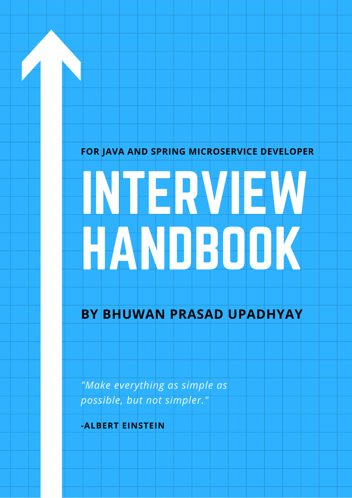

# Interview Handbook

#### Descriptions:

* This book covers the coding interview, java, spring, testing, microservice architecture, software design questions.
* Book provides complete handful guide for real interview questions that you are going to encounter in your next interview.
* Book mostly focuses on best practices for real time projects while answering the questions.

